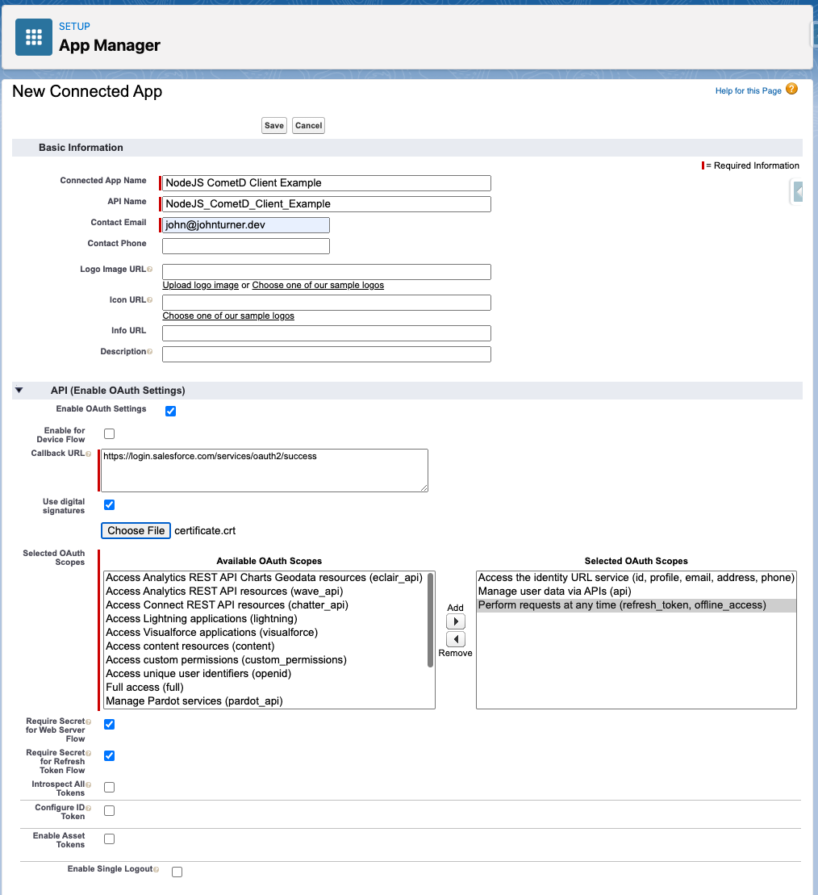

# NodeJS CometD <> Salesforce Example

## Requirements

- Node & NPM
- OpenSSL

## Setup

1. Duplicate `./scripts/generate-certificate.sh.example` into `./scripts/generate-certificate.sh`
1. Fill in your correct information in `generate-certificate.sh`
1. Run `cd scripts/ && chmod +x generate-certificate.sh && cd ..`
1. Generate the certificate: `npm run create-cert`
1. Set up Connected App with the `.crt` that was generated via the shell script (see below screenshot)
1. Navigate to Setup > Manage Connected Apps > Your newly-created App
1. Edit the app and switch the App's "Permitted Userss" option to `Admin approved users are pre-authorized`
1. Create a new Permission Set that allows access to this Connected App
1. Assign your user to the Permission Set
1. Set up the `config.json` according to the `config.json.example` template and the information from your Connected App and SFDC instance
1. Install dependencies `npm i`
1. Run: `npm run start`

_Example Connected App Setup_

